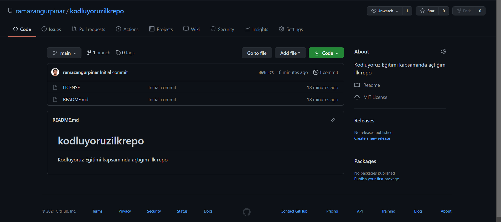

#  Kodluyoruz İlk Repo
Bu repo [Kodluyoruz](https://www.kodluyoruz.org/) Fronted-End Eğitiminde Oluşturduğumuz ilk repo içerisinde bir adet README dosyası, bir adet de index.html barındırıyor.



## Installation
Öncelikle projeyi clonelayın.
```

https://github.com/ramazangurpinar/kodluyoruzilkrepo.git

```
## Usage
Projeyi cloneladıktan sonra Visual Studio Code programında açınız.

Linux için:
```
cd kodluyoruzilkrepo
code .

````
## Contributing
Pull requestler kabul edilir. Büyük değişiklikler için, lütfen önce neyi değiştirmek istediğinizi tartışmak için bir issue açınız.

## License
[MIT](https://github.com/ramazangurpinar/kodluyoruzilkrepo.git)
